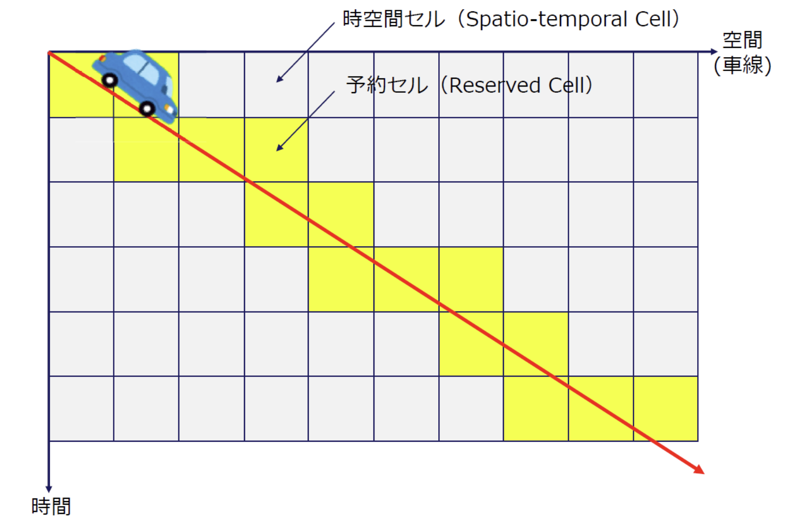

## 背景．目的
近年，協調型自動運転を用いた，車両の安全性の向上や交通効率の向上が研究されている．協調型自動運転とは，複数の自律走行車両が互いの位置や走行予定を共有し，衝突や混雑を避けるための技術である．  
本製品の目的は，micro:bit及びmicro:Maqueen Plus V2 for micro:bit(以降Maqueen)を利用した協調型自動運転の実現である．リアルタイム性を活用した，時空間グリッド予約システムを導入することにより，複数の自動車が相互干渉を行うことなく走行可能になる．本プログラムでは，各車両が走行予定ルートを他の車両と共有し，時空間上のグリッドを予約することで，交通の効率化と安全性の向上を図る． 加えて，マイクロコンピュータの特性を活かし低遅延での処理を実現することにより車両の安全性を確保した．サーバーとなるmicro:bit１台と，クライアント車両となるmicro:bitとMaqueen plus V2を３セット用意した．

## 関連内容

### 時空間グリッド予約

我々が所属している同志社大学ネットワーク情報システム研究室では，時空間グリッド予約の研究を行っている．時空間グリッド予約とは，ダイナミックマップを利用して道路上の空間と時間をグリッドに分割し，車両がそのグリッドを予約することで，各車両の走行計画を調整・共有する仕組みである．このシステムでは，道路を時間的・空間的に区切り，その区画ごとに車両が自分の走行経路を予約する．これにより，各車両が事前にどの区画をどの時間帯に通過するのかを把握し，衝突のリスクを減らすとともに，効率的な交通の流れを実現することが可能となる．研究室では，この時空間グリッド予約を活用した走行調停の研究を進めており，この技術により交通の効率化と安全性の向上が期待されている．以下に時空間グリッド予約の参考図を示す

本プログラムでは車両はサーバーに目的地の情報を送信し，どの時刻にどのグリッドを通過するかという情報をサーバから取得する．車両はセンサーからのデータを解析し，進行方向を判断しつつ，目的地に向かう．

## プログラムフロー
以下にプログラムのフローチャートを示す．

## プログラム詳細

全てのプログラムは以下URLに記載している． 
https://github.com/fai227/tron-project 
また，本プログラムでは，app\_sampleフォルダに以下ソースがある．

### app\_main.c
このファイルはプログラム全体のメイン部分を担っており，スタートボタン（AボタンやBボタン）が押されると，サーバーや車両の動作を開始する．プ

- Aボタン
  - サーバーを起動し，時空間グリッドの初期設定および起動，クロック，通信，割り込み設定を行う．  
- Bボタン
  - 車両を起動する．走行プログラムが必要に応じて予約のための車両通信プログラムを起動する．
- A+Bボタン（同時押し）
  - テストモードを起動
  - 1~9番までの対応するテストを実行可能
  - 詳細はプログラムをチェック

### client.c
クライアントの通信処理を担っている．具体的には，サーバーとの無線通信において，データの送受信やパケットの管理を行う処理を実装した．  
1. request\_departure\_time\_ms:
   - サーバーと通信して道路環境への侵入可能時間を取得する関数． また，内部的には車両のIDを取得し，通信における論理アドレスを設定している． 
2. reserve\_order:
   - サーバーと通信して，指示リストに予約内容を追加する関数．

### drive.c
移動やラインセンサーを使った交差点の検知など，Maqueen の運転に関する機能を実装した．  
1. read\_timer\_value
   - タイマーの現在値を読み取る関数．タイマーの値を取得することで，走行時間の計測が可能になる．  
2. initialize_timer
   - タイマーの初期化，設定を行う関数．  
3. start\_timer
   - 高周波クロックを開始し，タイマーを設定・クリアして，タイマーを開始する関数．この関数を使ってMaqueen Plusの動作時間を測定する準備する．  
4. stop\_timer 
   - タイマーを停止し，経過した時間を返す関数．ミリ秒（ms）に変換して返す．  
5. is\_intersection
   - Maqueen のラインセンサーを使って，現在位置が交差点かどうかを検知する関数．
   - この関数は，MAQUEENのL2やR2センサの状態を確認し，交差点に到達したかを判定する．  
6. turn\_left， turn\_right
   - 左折および右折のための関数．モーターの制御を行い，Maqueen Plusが指定された方向に回転するように制御する．交差点での回転動作が完了した後，タイマーで測定した時間を使って，残りの時間を調整する．  
7. follow\_path
   - Maqueen が指定の指示をする関数．直進ではline\_tracking()（黒線に沿った走行）を行い，交差点に到達すると，継続時間まで待機する．右左折では，turn_right()，turn_left()の関数を呼び，継続時間まで待機する．
8. start\_drive
   - この関数は、Maqueen Plusの走行を開始する関数．サーバーから出発時間を取得し，その時間まで待機したあと経路の予約を行い、待機する。ループの中で，follow_pathの呼び出しと新しい経路のリクエスト，そして実行済みの指示の削除を行う．  
9. calculate_departure_delay
   - 現在残っている指示すべての所要時間の合計を計算する関数．  
10. process_orders
    - 残りの指示が一定以下になると，reserve_orderを呼び出す．

### iic.c
I2CによるMaqueenなどの外部デバイスと通信を定義しており，デバイスとの通信を円滑に行うためのインターフェースを提供する．

### LEC.c
1. initialize_led
    - LEDの初期化を行う関数．ダイナミック点灯のための割込み設定などもここで行う．
2. clear_led
    - LEDをすべてオフにする関数．
3. turn_on_led
    - 行と列で1箇所のLEDを点灯させる関数．
4. show_number
    - 引数で与えられた数値をLEDで表示する関数．
    - 0未満，10以上の数値が与えられた場合はshow_crossを実行する．
5. show_circle
    - 〇を表示する関数．
6. show_cross
    - ✕を表示する関数．
7. show_〇（S・V・T）
    - 〇（S・V・T）を表示する関数．
      - S: Server
      - V: Vehicle
      - T: Test
8. show_logo
    - ロゴを表示する関数
    - ネットワーク情報システム研究室の通称，「NISLab」を表示する．
9.  show_〇（strait・left・right・stop）
    - 与えられた指示を矢印で表示する関数．
    - stopの場合はshow_crossを実行する．

### list.c
1. List \*list\_init
   - 新しいリストを初期化する関数．リストのメモリを動的に確保し，新しいリストを初期化する．  
2. void list\_unshift
   - リストの先頭に要素を追加する．新しい要素をメモリに確保し，リストの先頭に追加するロジックを実装した．  
3. void list\_append
   - リストの末尾に要素を追加する関数．  
4. void \*list\_shift
   - リストの先頭から要素を取り出して削除する関数．  
5. void \*list\_get
   - リスト内の特定のインデックスにある要素を取得する関数．インデックスに基づいて，指定された要素を返す．  
6. void list\_delete
   - リスト全体を削除し，メモリを解放する関数．  
7. UH list\_length
   - リストの長さを返す関数．

### maqueen.c
1. maqueen\_init
   - Maqueenの初期化を行う関数．I2Cの初期設定 (iic\_setup) を行う．
2. control\_motor
   - 指定されたモーター（左，右，または両方）を制御する関数．I2C通信を介して，モーターの進行方向と速度を設定する．  
3. stop\_all\_motor
   - すべてのモーターを停止する関数．左右のモーターの速度を0に設定し，停止させる．  
4. control\_led
   - 指定されたLED（左または右）をオンまたはオフにする関数．LEDの状態（オン/オフ）をI2C通信で設定する．  
5. turn\_off\_all\_led
   - すべてのLEDをオフにする関数．左右のLEDのレジスタに対して，オフを設定する．  
6. read\_line\_state
   - 指定されたラインセンサーがラインを検知しているかどうかを返す関数．I2C通信でセンサーの状態を読み取る．
7. read\_line\_value
   - ラインセンサーの値を取得する関数．各センサーの値をI2C通信で読み取り，0から255の範囲の値を返す．

### \- order.c
1. is\_forward
   - 命令が「前進」かどうかを判定．命令の上位4ビットをシフトして確認する．  
2. is\_backward
   - 命令が「後退」かどうかを判定．上位4ビットを確認．  
3. is\_left
   - 命令が「左折」かどうかを判定．上位4ビットが TURN\_LEFT に一致するかを確認する．  
4. is\_right(Order order
   - 命令が「右折」かどうかを判定．上位4ビットが TURN\_RIGHT に一致するかをチェックする．  
5. get\_order\_duration
   - 命令の持続時間（秒）を返す．下位4ビットを抽出して，そのビット値を持続時間として返す．  

### \- server.c
1. print\_packet
   - パケット内の各バイトを16進数で表示する．  
2. radio\_interrupt\_handler
   - 無線通信で発生した割り込み（イベント）を処理するためのハンドラ．割り込みが発生した際に，無線モジュールの状態に応じてデータの受信や送信を制御する．  
4. start\_server
   - サーバーを開始する関数．この関数内では，無線通信の設定を行い，サーバーが通信を受け付ける準備をする．

## 実行方法
本プログラムの実行には，micro:bit 4台とMaqueen Plus3台を用意する．
micro:bit１台をサーバーとし，残りのmicro:bit３台をMaqueen Plus３台と組み合わせてクライアント車両とする．
操作方法としては，micro:bitのボタン操作により，デバイスをサーバーとして起動するか，クライアント車両として起動するかを選択する．
車両を道路環境上の決められた地点にセットし，走行を開始する．

## 結果
複数の車両が協調して走行できるかを確認するために，合計X回の実験を行い，本プログラムの性能を評価した．
1. 動作異常: 実験結果，X回中Y回の動作異常が発生した．特に通信タイムアウトや車両停止が確認された．
2. 衝突回数: 衝突はZ回発生し，安全性においてさらなる改良が必要であると判断された．
3. 目的地までの移動時間: 各車両の目的地までの移動時間の平均はA秒であり，最短B秒，最長C秒となった．

## 考察

## 終わりに
