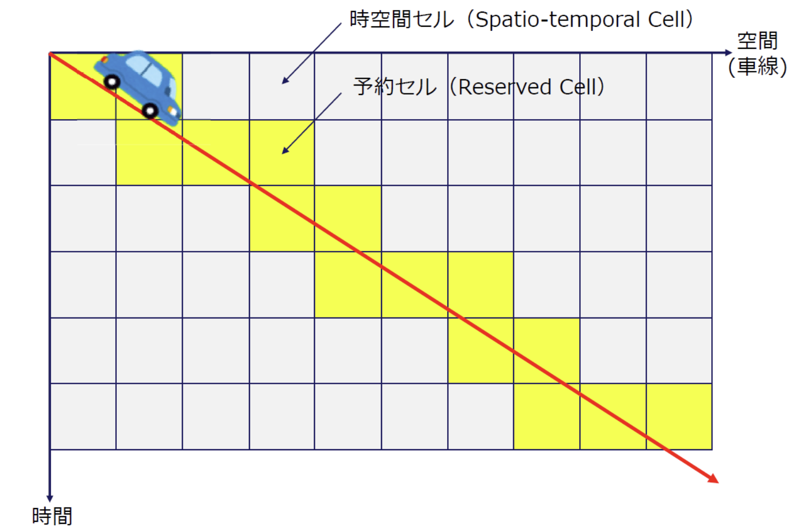
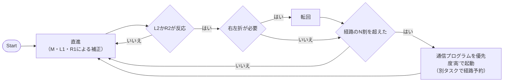
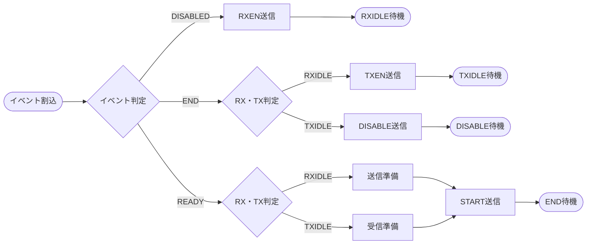
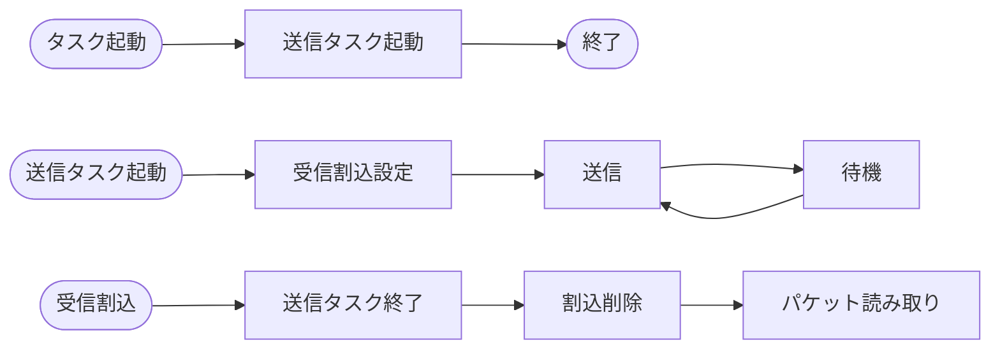
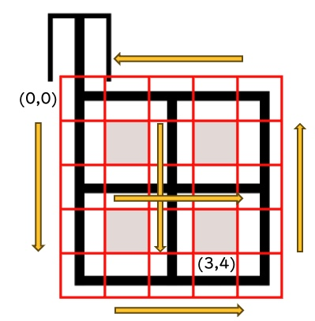

## 概要
近年，協調型自動運転を用いた，車両の安全性の向上や交通効率の向上が研究されている．協調型自動運転とは，複数の自律走行車両が互いの位置や走行予定を共有し，衝突や混雑を避けるための技術である．  
本プログラムの目的は，micro:bit及びmicro:Maqueen Plus V2 for micro:bit(以降Maqueen)を利用した協調型自動運転の実現である．時空間グリッド予約システムを導入することにより，複数の自動車が相互干渉を行うことなく走行可能になる． 本プログラムでは，各車両が走行予定ルートを他の車両と共有し，時空間上のグリッドを予約することで，車両の安全性の向上や交通効率の向上を図る．加えて，リアルタイム性を活かすために，リアルタイムOS（RTOS）μT-kernelの特性を活用し，低遅延での処理を実現することで車両の安全性を確保した．

## 関連内容

### 時空間グリッド予約

我々が所属している同志社大学ネットワーク情報システム研究室では，時空間グリッド予約の研究を行っている．時空間グリッド予約とは，ダイナミックマップを利用して道路上の空間と時間をグリッドに分割し，車両がそのグリッドを予約することで，各車両の走行計画を調整・共有する仕組みである．このシステムでは，道路を時間的・空間的に区切り，その区画ごとに車両が自分の走行経路を予約する．これにより，各車両が事前にどの区画をどの時間帯に通過するのかを把握し，衝突のリスクを減らすとともに，効率的な交通の流れを実現することが可能となる．研究室では，この時空間グリッド予約を活用した走行調停の研究を進めており，この技術により交通の効率化と安全性の向上が期待されている．以下に時空間グリッド予約の参考図を示す．

 
本プログラムでは車両はサーバーに目的地の情報を送信し，どの時刻にどのグリッドを通過するかという情報をサーバーから取得する．車両はMaqueenのライントラッキングセンサー（以下センサー）からのデータを解析し，進行方向を判断しつつ，目的地に向かう．

## プログラムフロー
以下にプログラムのフローチャートを示す．
### 走行プログラム

走行プログラムは直進や右左折などの動作を行うことで車両が進行方向を修正しながら自律的に移動する．
走行中，定期的にセンサーをチェックし，右左折が必要な場合を判断する．このフローの中で，経路の何割を超えたかを判断し，設定された条件を超えた場合には，サーバーとの通信プログラムを起動する． 
通信プログラムが起動されると，車両はサーバーとの間で経路予約通信を行う．車両はまずサーバーに対して，旅行開始時刻，開始地点，終了地点を送信し，サーバーからは経路指示の配列が返送される．通信パケットは旅行開始時刻，旅行開始地点の座標，および旅行終了地点の座標で構成される．サーバーが返送するパケットには，経路指示が複数のコマンドとして含まれており，車両はこれに基づいて指定された経路を走行する．

### サーバー通信プログラム

サーバーはまずイベント割込が発生した際に，イベントの判定を行う．ここで判定された内容に応じて，送信タスクまたは受信タスクが開始される．
車両との通信は，ID取得通信と経路予約通信の2つが主に行われる．まず，ID取得通信では，車両はサーバーに対して論理アドレスを要求する．この際，車両は初回の通信で論理アドレス0を使用し，サーバーから1〜7の範囲で論理アドレスが返送される．その後，車両はサーバーに対して経路予約通信を行い，旅行開始時刻，旅行開始地点，旅行終了地点の情報を送信する．サーバーはこれを受け取り，車両に対して適切な経路指示を含むパケットを返送する． 
また，送信タスクでは，車両がリクエストした経路予約通信に対して，経路指示の配列を返送する．この経路指示には，移動方向や転回，停止などのコマンドが含まれており，車両が自律的に指定されたルートを進行できる．

### クライアント通信プログラム

クライアント通信プログラムが起動されると，送信タスクを起動する．送信タスクは受信割込を設定し，送信を実行する．サーバー側が受信できなかった場合を考慮し，一定間隔で再送する設定を行い，待機状態に入る．次に，受信割込が発生すると，受信タスクを終了させ，再送設定を削除し，パケットの読み取りが行われる．

## プログラム詳細

全てのプログラムは以下URLに記載している． 
https://github.com/fai227/tron-project 
また，本プログラムは，app\_sampleフォルダに格納されている．

### app\_main.c
このファイルはプログラム全体のメイン部分を担っており，スタートボタン（AボタンやBボタン）が押されると，サーバーや車両の動作を開始する．

- Aボタン
  - サーバーを起動
  - 時空間グリッドの初期設定および起動
  - クロック，通信，割込設定
- Bボタン
  - 車両を起動
  - 走行プログラムが必要に応じて予約のための車両通信プログラムを起動
- A+Bボタン（同時押し）
  - テストモードを起動
  - 1~9番までの対応するテストを実行可能
  - 詳細はプログラムをチェック

### client.c
クライアントの通信処理を担っている．具体的には，サーバーとの無線通信において，データの送受信やパケットの管理を行う処理を実装した．  
1. request\_departure\_time\_ms
   - サーバーと通信して道路環境への侵入可能時間を取得する関数． また，内部的には車両のIDを取得し，通信における論理アドレスを設定している． 
2. reserve\_order
   - サーバーと通信して，指示リストに予約内容を追加する関数．

### drive.c
移動やセンサーを使った交差点の検知など，Maqueen の運転に関する機能を実装した．

1. calculate\_departure\_delay\_s
   - 現在残っている指示すべての所要時間の合計を計算する関数． 
2. process\_orders
   - 残りの指示が一定以下になると，reserve_orderを呼び出す．
3. is\_intersection
   - センサーを使って，現在位置が交差点かどうかを検知する関数．
   - この関数は，MaqueenのL2やR2センサの状態を確認し，交差点に到達したかを判定する．  
4. line\_tracking
   - ライントラッキングを行い，常にラインの追跡を行う関数．
5. turn\_right， turn\_left
   - 左折および右折のための関数．モーターの制御を行い，Maqueenが指定された方向に転回するように制御する．交差点での転回動作が完了した後，タイマーで測定した時間を使って，残りの時間を調整する．  
6. follow\_path
   - Maqueen が指示を実行する関数．直進ではline\_tracking（黒い線に沿った走行）を行い，交差点に到達すると，継続時間まで待機する．右左折では，turn_right，turn_leftの関数を呼び，継続時間まで待機する．
7. start\_drive
   - この関数は，Maqueenの走行を開始する関数．サーバーから出発時間を取得し，先に経路の予約を行い，待機する．ループの中で，follow_pathの呼び出しと新しい経路の予約，そして実行済みの指示の削除を行う．  
 

### iic.c
I2CによるMaqueenなどの外部デバイスとの通信を実装しており，デバイスとの通信を円滑に行うためのインターフェースを提供する．

### LED.c
micro:bitについている5×5のLEDをダイナミック点灯により表示させるための関数をまとめている．
1. initialize_led
    - LEDの初期化を行う関数．ダイナミック点灯のための割込設定などもここで行う．
2. clear_led
    - LEDをすべてオフにする関数．
3. turn_on_led
    - 行と列で1箇所のLEDを点灯させる関数．
4. show_number
    - 引数で与えられた数値をLEDで表示する関数．
    - 0未満，10以上の数値が与えられた場合はshow_crossを実行する．
5. show_circle
    - 〇（丸印）を表示する関数．
6. show_cross
    - ✕（バツ印）を表示する関数．
7. show_〇（S・V・T）
    - 〇（S・V・T）を表示する関数．
      - S: Server
      - V: Vehicle
      - T: Test
8. show_logo
    - ロゴを表示する関数
    - ネットワーク情報システム研究室の通称，「NISLab」を表示する．
9.  show_〇（strait・left・right・stop）
    - 与えられた指示を矢印で表示する関数．
    - stopの場合はshow_crossを実行する．

### list.c
この関数は，μT-kernel上で動作するLinkedListを実装した．
1. \*list\_init
   - 新しいリストを初期化する関数．リストのメモリを動的に確保し，新しいリストを初期化する．  
2. list\_unshift
   - リストの先頭に要素を追加する．新しい要素をメモリに確保し，リストの先頭に追加する．  
3. list\_append
   - リストの末尾に要素を追加する関数．  
4. \*list\_shift
   - リストの先頭から要素を取り出して削除する関数．  
5. \*list\_get
   - リスト内の特定のインデックスにある要素を取得する関数．インデックスに基づいて，指定された要素を返す．  
6. list\_delete
   - リスト全体を削除し，メモリを解放する関数．  
7. list\_length
   - リストの長さを返す関数．

### maqueen.c
I2C通信により，Maqueenのライントレーサーやモーターなどの制御を行う関数を実装した．
1. maqueen\_init
   - Maqueenの初期化を行う関数．I2Cの初期設定を行う．
2. control\_motor
   - 指定されたモーター（左，右，または両方）を制御する関数．
3. stop\_all\_motor
   - すべてのモーターを停止する関数．左右のモーターの速度を0に設定し，停止させる．  
4. control\_led
   - 指定されたLED（左または右）をオンまたはオフにする関数．LEDの状態（オン/オフ）を設定する．  
5. turn\_off\_all\_led
   - すべてのLEDをオフにする関数．
6. read\_line\_state
   - センサーがラインを検知しているかどうかを返す関数．
7. read\_line\_value
   - センサーの値を取得する関数．0（黒）から255（白）の範囲の値を返す．

### order.c
Order型は，8ビット（1バイト）のデータ型として定義され，その中に方向指示と動作の継続時間という2つの異なる情報を含む．8ビットの中で上位4ビットが方向指示を，下位4ビットが動作の継続時間を表現する． 
上位4ビットについて，この部分は，動作の方向を指示するために使用する．一番左のビットから，前後左右を表す．
下位4ビットについて，この部分は動作の継続時間を秒単位で表現するために使用する． 

1. is\_forward
   - 命令が「前進」かどうかを判定． 
2. is\_backward
   - 命令が「後退」かどうかを判定．  
3. is\_left
   - 命令が「左折」かどうかを判定．
4. is\_right
   - 命令が「右折」かどうかを判定．
5. get\_order\_duration
   - 命令の持続時間（秒）を返す．

### server.c
1. print\_packet
   - パケット内の各バイトを16進数で表示する．  
2. radio\_interrupt\_handler
   - 無線通信で発生した割込（イベント）を処理するためのハンドラ．割込が発生した際に，無線モジュールの状態に応じてデータの受信や送信を制御する．  
4. start\_server
   - サーバーを開始する関数．この関数内では，無線通信の設定を行い，サーバーが通信を受け付ける準備をする．

## 実行方法
### 想定環境
本プログラムでは，特定の経路や動作を指定して自律的に移動するシステムを想定した環境で使用されることを前提とする．具体的には，「田」の形をした道路環境を想定する．この環境において，グリッド状に区分されたエリアで，移動方向や経路が明確に決めた．加えて，外周や中央部分は一方通行でのみ走行可能とする．今回の環境では，Maqueenがスムーズに経路を進むことを可能にした． 
このグリッドは，5×5の構造を持ち，上下には下向きにY軸を，左右には右向きにX軸を取るように座標平面を定義する．例えば左上が(0,0)，右下が(4,4)となる．ただし，特定のエリア（(1,1)，(1,3)，(3,1)，(3,3)）は通行不可能なゾーンとして設定する．また，(0,0)のグリッドよりも上部にあるセルは，車両が侵入するためのセルである． 以下に道路環境の図を示す． 

### 実験環境印刷方法
また，車両が走行する道路についてはroad_environmentフォルダ内のroad_enviroment.pdfをAdobe Acrobatにて開き印刷する．ただし，印刷する際はページサイズ処理をポスターにして印刷する．また，詳細な印刷方法に関しては，同フォルダ内how_to_print.pdfファイルを参照のこと．印刷した道路環境を，テープまたは糊を用いて接着させること．シワが入った場合には，Maqueenが交差点と認識する場合があるため，接着には十分に留意すること．
### プログラム実行方法
本プログラムの実行には，micro:bitを4台とMaqueenを3台を用意する必要がある．ただし，最低限micro:bit2台とmaqueen1台で動作可能であるが，今回の実験ではmicro:bitを4つmaqueenを3つ使うことを想定している． 
micro:bit1台をサーバーとし，残りのmicro:bit3台をMaqueen3台と組み合わせてクライアントの車両とする．
操作方法としては，micro:bitのボタン操作により，デバイスをサーバーとして起動するか，車両として起動するかを選択する．
車両を道路環境上の決められた地点にセットし，走行を開始する．ただし，(0,0)～(4,0)（侵入地点の右）に車両が存在する場合は，車両モードをオンにすることを禁止する． 
Maqueenが動作不良を起こす場合は，ライントレーサーのキャリブレーションを行う． 
参考URL 
https://docs.iftiny.com/jp/education/microbit/robots/dfrobot/micro-maqueen-plus/line-tracking/#_12-7-%E3%83%A9%E3%82%A4%E3%83%B3%E3%83%88%E3%83%AC%E3%83%BC%E3%82%B5%E3%83%BC%E3%81%AE%E3%82%AD%E3%83%A3%E3%83%AA%E3%83%95%E3%82%99%E3%83%AC%E3%83%BC%E3%82%B7%E3%83%A7%E3%83%B3

## 結果
### 評価内容
複数の車両が協調して走行できるかを確認するために，合計X回の実験を行い，本プログラムの性能を評価した．
1. エラー発生回数​：グリッドの予約競合によるMaqueen同士の衝突やライン外の走行​．
2. CPU使用率：​一定期間中にCPUがアクティブに動作している時間の割合．以下の式で表される．
$$
CPU使用率 = \frac{トレース対象のタスクやハンドラの実行時間の和}{(最後のイベントの時刻−最初のイベントの時刻)}
$$

### 実験結果
今回の実験では，複数の車両が協調して走行するシステムの評価を目的とし走行実験を行った．実験結果は以下の通りである． 

1. エラー発生回数 
車両台数が2台のとき5回の実験中1回動作異常が発生した．車両台数が3台のとき5回の実験中4回動作異常が発生した．具体的には，Hard faultによるサーバーの強制終了と，後方車両が前方車両に追いついてしまい衝突する事象が確認された．これらのケースでは，サーバーからの経路指示を適切に受信できず，車両が進行できなくなった．

2. CPU使用率 
車両台数が1台のときのサーバー及び，車両のCPU使用率を計算した． 
サーバーのログをserver-trace-versionブランチのサーバー用ログに保管しており，車両のログをclient-trace-versionブランチのクライアントログに保管している． 
5回の実験を行った結果，サーバーの平均CPU使用率は0.20%で，車両の平均CPU使用率は0.89%であった．しかし，車両は割込み発生回数が多いため，メモリの関係上ごく短時間のログしか取得することができなかった．

## 考察
実験結果から，複数の車両が協調して走行するシステムは一定の成功を収めたものの，いくつかの課題が明らかになった．まず，エラー発生についてはサーバーと車両の双方に原因があった．サーバーのHard faultについては，時空間グリッドのメモリ管理が不十分だったため発生したと考えられる．車両の衝突については，グリッド予約システムの改善が必要である．今回の衝突は，2台の車両が同時に同じグリッドに進入することで発生したが，これを防ぐために，サーバー側での経路予約の競合回避アルゴリズムを強化し，車両の進入タイミングをさらに細かく制御することが求められる．また，車両の個体差による速度のばらつきがあったため，超音波センサーを利用することで衝突回避することができると考えられる．

CPU使用率は，サーバーと車両がともに1%以下という結果となった．，サーバーとの通信待ちや，センサー情報の応答待ちの間はCPUが解放されており，CPUを効率的に利用している．タスクの切換も円滑に行えており，RTOSの強みを発揮することができた．

## 終わりに
本プログラムでは、micro:bitとMaqueenを使用し，時空間グリッド予約システムに基づく協調型自動運転の実現に取り組んだ．協調型自動運転の制御には，μT-kernelを活用し，リアルタイムでの車両間通信とスケジューリングの調整が可能であることを確認した．また，時空間グリッド予約システムによる安全かつ効率的な走行ルートの確保ができることを示した． 
今後の課題として，より大規模な車両群に対する拡張性の評価や，異なる通信方式（V2V,V2I）の組み合わせによる通信効率の最適化が挙げられる．さらなるシミュレーションや実車両を用いた実験を通じて，より実用的な協調型自動運転システムの構築を目指していきたい．
