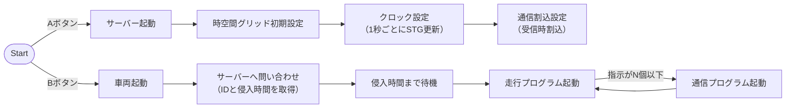
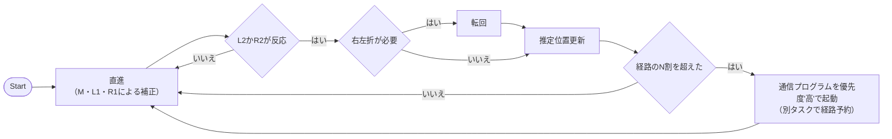
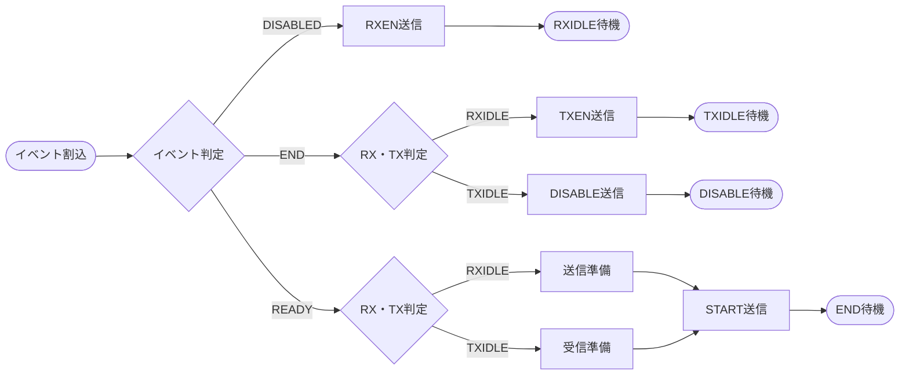
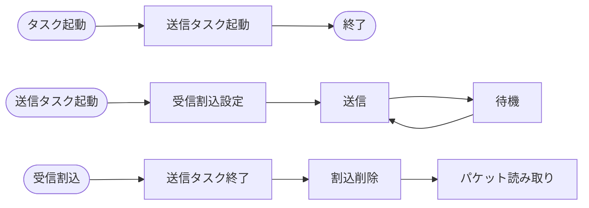

# ルール
- include/tk/typedef.hで型を参照すること
  - signed char -> B
  - unsigned short -> UH
  - など
- 変数・関数は小文字のスネークケース
  - X snakeCase
  - X Snake_Case
  - O snake_case
- 変数・関数の名前は短すぎず長すぎず
  - どれぐらい説明するかは、iic_reg.cやnrf5_iic.cなどを参照

# プログラム群
- iic.h
- iic.c
  - iic通信用の関数群
- maqueen.h
- maqueen.c
  - maqueenとのI2C通信用の関数
    - 参考：https://github.com/DFRobot/pxt-DFRobot_MaqueenPlus_v20/blob/26d3ceedbe27398fa450970a57e2fe4e0bbf2b69/maqueenPlusV2.ts#L185
    - これをCに書き換えるイメージでOK
  - 関数群
    - void maqueen_init()
    - void control_motor(motor, direction, speed)
    - void control_motor_stop()
    - void control_LED(led, switch)
    - B read_line_sensor_state(line)
      - 0-1を返す
    - UB read_line_sensor_value(line)
      - 0-255を返す
    - UB or UH read_ultrasonic()
      - 距離を返す
- radio.h
- radio.c
  - 関数群
    - void radio_init()
    - void transmit_data(検討中)
    - 戻り値の型 receive_data(検討中)

# 拡張機能
- Serial Monitor（Micro:bitのログを見れる，Tera Term不必要になるよ）

# フローチャート
## プログラムフロー

## 走行プログラム

## サーバー通信プログラム

## クライアント通信プログラム

